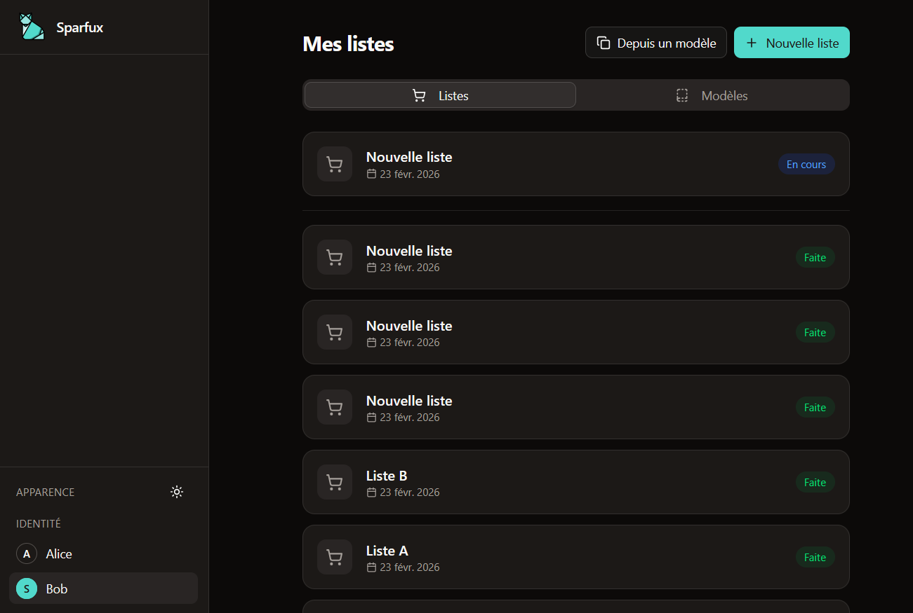
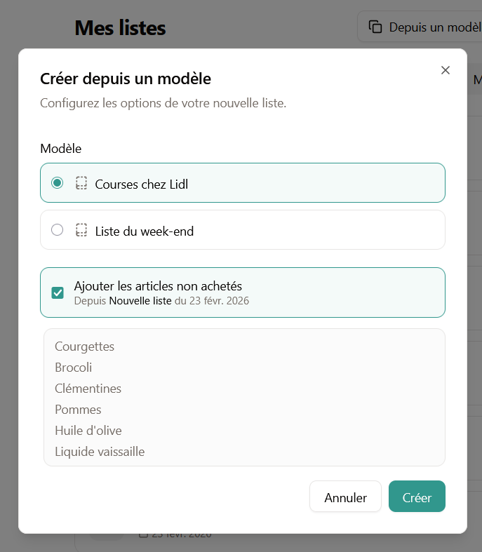

# Coursify

Shared shopping list application for couples. Manage grocery lists together with offline support and simple Markdown-based editing.

## Key features

- Simple auth with a shared passphrase
- Multiple shared shopping lists
- List templates
- Importing unchecked items from previous lists
- Smart markdown editor with live preview
- Mobile design first
- PWA
- Light/dark mode
- Offline editing

### Shared shopping lists


### Live markdown editor


### Shopping lists templates
Possibility to import unbought items from previous lists.



## Prerequisites

- **Node.js** 18+ 
- **PostgreSQL** 12+ (local installation or Docker)

## Install

Clone the repo then:
```
npm install
```

Create a postgresql database and user.
Add the database URL to the .env file.

Set up a passphrase that will be used as an auth method:
```
node -e "const{createHash}=require('crypto');console.log(createHash('sha256').update('YOUR_PASSPHRASE').digest('hex'))"
```
Paste the result into a `PASSPHRASE_HASH` variable in the .env file

Add a JWT secret to the .env file
```
openssl rand -hex 32
```


## Project Structure

```
coursify/
├── docs/
│   ├── prd.md                 # Product requirements
│   └── technical-spec.md      # Technical specifications
├── drizzle.config.ts          # Drizzle ORM config
├── eslint.config.js           # ESLint setup
├── package-lock.json
├── package.json
├── src/
│   ├── app.d.ts               # App typings
│   ├── app.html               # HTML template
│   ├── lib/
│   │   ├── assets/
│   │   │   └── favicon.svg    # App favicon
│   │   ├── index.ts           # Library exports
│   │   └── server/
│   │       └── db/            # Database client + schema
│   │           ├── index.ts
│   │           └── schema.ts
│   ├── routes/                # Roots
├── static/
│   └── robots.txt             # Robots policy
├── svelte.config.js
├── tsconfig.json
├── vite.config.ts
├── .env.example               # Environment variables template
├── .gitignore
├── .npmrc
├── .prettierignore
├── .prettierrc
└── README.md
```

